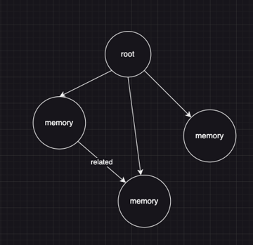

# Data_Spatial_Programming_With_Jac

This repository contains the code and data for the Spatial Programming with Jac language


```
node memory {
    has summary: str;
    has when: str;
    has who: str;
    has where: str;
    has what: str; 
}
edge related {}
```

Write an app.jac that has two walkers

1. add memory walker
    - takes in as parameter properties of the memory
    - create a memory node
    - also link this newly created memory node with any existing memories that are related
        - two memories are related when they share at least one of the same attributes.
        - e.g. if two memories both have when to be 2024-04-29 then they are related

2. get related memory walker
    - takes in the node id of an existing memory node
    - return all of its related memories

Structure of the app.jac file
<!-- add image -->

